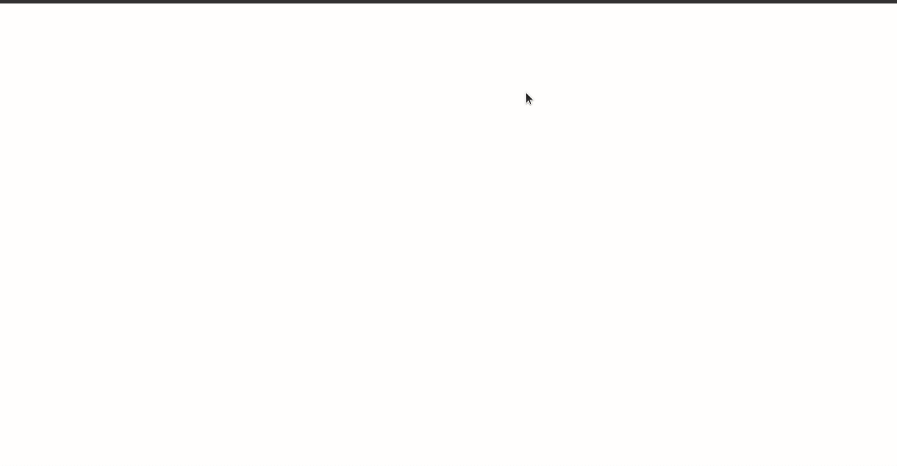

# React Youtube Clone

> A youtube clone maded with react and material ui

 


## File Structure

Within the download you'll find the following directories and files:

```
html5_animated_login_screen
├── package.json
├── public
│   ├── favicon.ico
│   ├── images
│   │   ├── avatar.jpeg
│   │   ├── branco.png
│   │   ├── preto.png
│   │   ├── screenshot.gif
│   │   ├── thumb1.png
│   │   ├── thumb2.png
│   │   ├── thumb3.png
│   │   ├── thumb4.png
│   │   ├── thumb5.png
│   │   ├── thumb6.png
│   │   ├── thumb7.png
│   │   └── thumb8.png
│   ├── index.html
│   ├── logo192.png
│   ├── logo512.png
│   ├── manifest.json
│   └── robots.txt
├── README.md
├── src
│   ├── App.js
│   ├── Home.js
│   ├── index.js
│   └── logo.svg
└── yarn.lock
```

## Browser Support

At present, we officially aim to support the last two versions of the following browsers:

    

## Meta

Linkedin Profile – [Messias Geovani](https://www.linkedin.com/in/messiasgeovani/) 

Email – messias.geovani.lima@gmail.com

Github profile – [messiasGeovani](https://github.com/messiasGeovani)

## Contributing

1. Fork it (<https://github.com/messiasGeovani/react-youtube-clone/fork>)
2. Create your feature branch (`git checkout -b feature/fooBar`)
3. Commit your changes (`git commit -am 'Add some fooBar'`)
4. Push to the branch (`git push origin feature/fooBar`)
5. Create a new Pull Request
